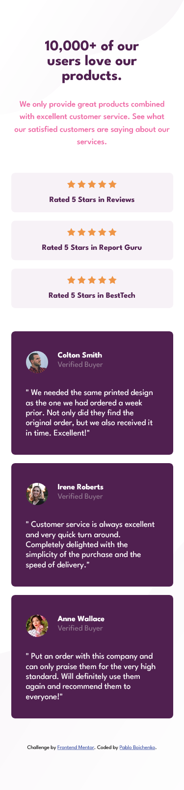
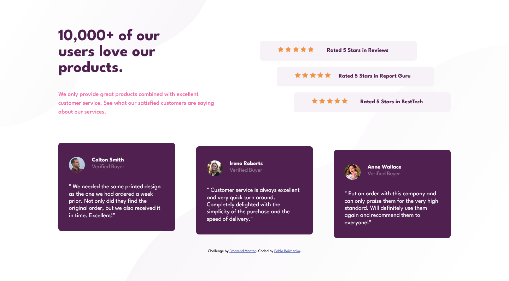

# Frontend Mentor - Social proof section solution

This is a solution to the [Social proof section challenge on Frontend Mentor](https://www.frontendmentor.io/challenges/social-proof-section-6e0qTv_bA). Frontend Mentor challenges help you improve your coding skills by building realistic projects. 

## Table of contents

- [Overview](#overview)
  - [The challenge](#the-challenge)
  - [Screenshot](#screenshot)
  - [Links](#links)
- [My process](#my-process)
  - [Built with](#built-with)
  - [What I learned](#what-i-learned)
  - [Continued development](#continued-development)
  - [Useful resources](#useful-resources)
- [Author](#author)
- [Acknowledgments](#acknowledgments)

**Note: Delete this note and update the table of contents based on what sections you keep.**

## Overview

### The challenge

Users should be able to:

- View the optimal layout for the section depending on their device's screen size

### Screenshot

### Links

- Solution URL: [https://github.com/PablinViking/Califications-page]
- Live Site URL: [https://pablinviking.github.io/Califications-page/]

## My process

### Built with

- Semantic HTML5 markup
- CSS custom properties
- Flexbox
- CSS Grid
- Mobile-first workflow

### What I learned

This is my first challenge, i lerned how to use flexbox and grid in a dynamic way and how to messure all the components and place them in the rigth way.

It was fun to do 😄

### Continued development

Learn how to place my objets in the best way possible, trai allways to respect the desing that it´s given to me. 

### Useful resources

## Author

- Website - [https://github.com/PablinViking]
- Frontend Mentor - [https://www.frontendmentor.io/profile/PablinViking]
- Instagram - [https://www.instagram.com/pabloboichenko/]

## Acknowledgments

-Thank´s to David Ruiz, my teacher, he give me this challange 
-David Ruiz page - [https://www.youtube.com/@CodingTube]
